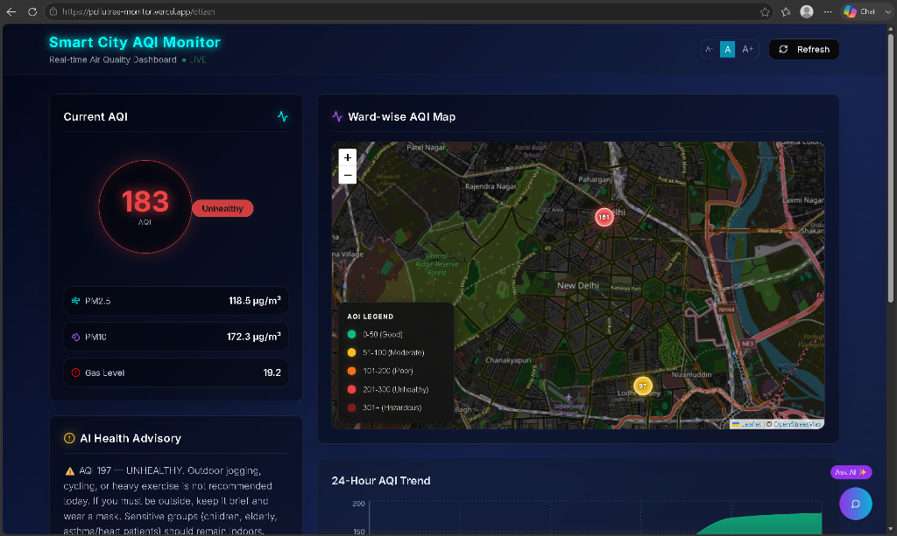
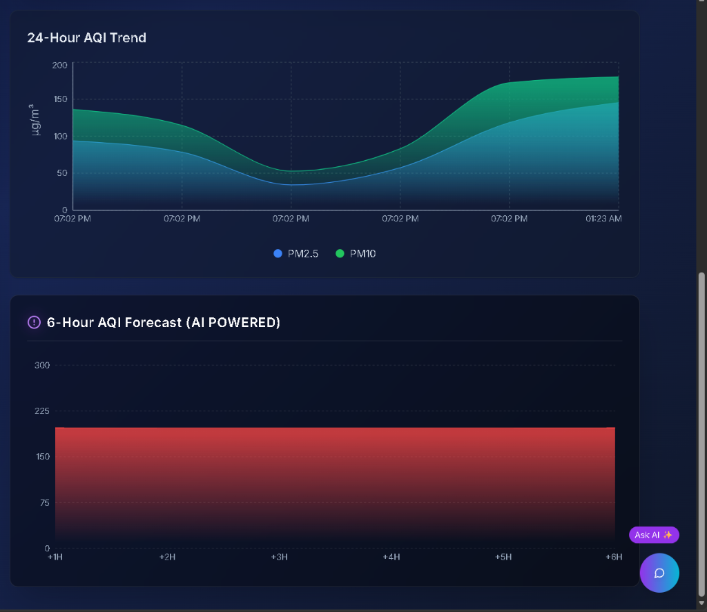
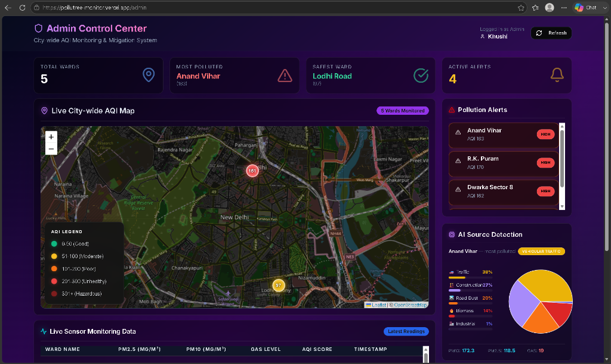
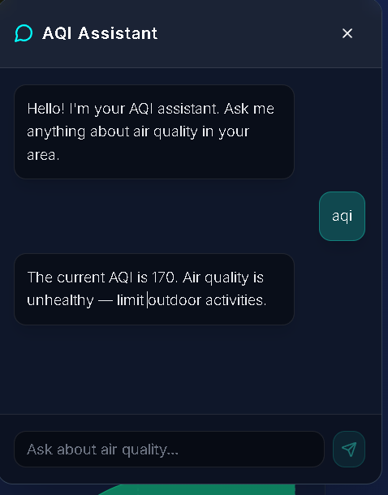

<div align="center">


<br/>

**India breathes 7× more PM2.5 than the WHO limit — yet nobody can tell you what your *street* is breathing right now.**

*Pollutree changes that.*

<br/>

[](https://pollutree-monitor.vercel.app)
&nbsp;

&nbsp;

&nbsp;

&nbsp;


</div>

---

## 🌫️ The Problem We're Solving

> *"Delhi AQI: 187 — Moderate."*

That number means nothing if your ward is sitting at 340 next to a construction site, while the park three kilometers away pulls the city average down.

**City-wide AQI averages are a lie by omission.** They mask hyperlocal toxic hotspots under deceptively reassuring headlines. Citizens make health decisions — whether to open windows, let kids play outside, go for a run — based on data that doesn't represent *their* air.

Pollutree Monitor was built to fix this.

By deploying low-cost ESP32 IoT sensors at the ward level and fusing that raw hardware data with Gemini AI intelligence, Pollutree delivers **real-time, hyper-local AQI visibility** — down to the street, not just the city.

---

## 📸 Screenshots

> 🌟 **Live at:** [pollutree-monitor.vercel.app](https://pollutree-monitor.vercel.app)

### 🗺️ Citizen Dashboard — Live Heatmap

*Interactive Leaflet.js heatmap with live color-coded ward markers, real-time AQI scores, and Gemini-powered health advisories.*

### 📊 Trend Analysis & Sensor Breakdown

*Recharts trendlines mapping historical AQI shifts across wards — identify peak pollution windows at a glance.*

### 🛡️ Admin Control Center

*Auth-protected municipal command center: AI-driven pollution source detection, live data grid with microsecond timestamps, and one-click mitigation actions.*

### 🤖 Gemini AI Chatbot

*Ask: "Is it safe to run in Lodhi Road today?" — Get an instant, AQI-aware, natural language response powered by Gemini 2.5 Flash.*

---

## ✨ Features

### 👤 Citizen Dashboard `/citizen`

| Feature | What It Does |
|---|---|
| 🌡️ **Live Ward Pulse** | Real-time AQI scores, color-coded by severity (Good → Hazardous) per neighborhood |
| 🧪 **Sensor Breakdown** | PM2.5, PM10, and hazardous gas readings straight from physical ESP32 nodes |
| 🗺️ **Interactive Heatmap** | Leaflet.js map with live, color-coded ward markers — see exactly which zones are dangerous |
| 🧠 **Gemini Health Advisories** | Context-aware safety recommendations from Gemini 2.5 Flash, with a bulletproof rule-based fallback |
| 📈 **AQI Trendlines** | Historical Recharts graphs to spot peak pollution windows and daily patterns |
| 🚨 **Active Alert Panel** | Instantly flags every ward that breaches the AQI 100 threshold |
| 💬 **Floating AI Chatbot** | Ask anything: *"Should I let my kids play outside?"* — real answers, not generic advice |

### 🛡️ Admin Dashboard `/admin` — Auth Protected

| Feature | What It Does |
|---|---|
| 📊 **City-Wide Control Center** | Live overview: active alerts, safest zones, total reporting sensor nodes |
| 🔍 **AI Source Detection** | Algorithmically identifies likely pollution source (construction dust, industrial exhaust, biomass burning, traffic) from particulate/gas ratio analysis |
| 📝 **Real-Time Data Grid** | Scrollable live table with every reading, AQI conversion, and microsecond timestamps |
| ⚡ **Mitigation Quick Actions** | Deploy road water sprinklers or trigger traffic diversion with one tap |

---

## 🛠️ Tech Stack

| Layer | Technology | Why |
|---|---|---|
| **Frontend** | Next.js 14, React 18, Tailwind CSS, shadcn/ui | Blazing page loads, clean responsive design, reusable components |
| **Backend** | Next.js App Router API Routes | Serverless endpoints — no infrastructure to manage |
| **Database** | Supabase (PostgreSQL) | Real-time PostgreSQL with RESTful APIs, built for continuous time-series ingestion |
| **AI** | Google Gemini 2.5 Flash | Sub-second token generation for real-time health advisories and chatbot Q&A |
| **Auth** | Clerk (role-based) | Secure, zero-fuss user authentication protecting the admin panel |
| **Maps** | Leaflet.js + React Leaflet | Lightweight, open-source maps — no proprietary API costs |
| **Charts** | Recharts | Declarative, interactive React charts for clean AQI trendlines |
| **IoT Hardware** | ESP32 + MQ-135 + PMS5003 | Low-cost, deployable sensor nodes that push live air quality readings every 60 seconds |
| **Deployment** | Vercel | Seamless CI/CD with sub-second serverless cold starts |

---

## 🏗️ System Architecture

The platform operates on a fully automated data pipeline — from physical dust particles hitting a sensor to a citizen seeing their ward's AQI in under 3 seconds:

```
┌──────────────────────────────────────┐
│       ESP32 IoT Physical Sensor      │
│  (MQ-135 Gas Sensor / PMS5003 Dust)  │
└──────────────┬───────────────────────┘
               │
               │  POST /api/sensor  (JSON payload every 60s)
               ▼
┌──────────────────────────────────────┐
│      Next.js /api/sensor Route       │
│   Server-side EPA AQI Calculation    │
└──────────────┬───────────────────────┘
               │
               │  Store reading
               ▼
┌──────────────────────────────────────┐
│      Supabase Database (Postgres)    │
│     Time-series AQI readings store   │
└──────────┬───────────────────────────┘
           │                    │
           │ GET /api/readings  │  Run AI context queries
           ▼                    ▼
┌──────────────────┐   ┌──────────────────────┐
│  Citizen & Admin │   │  Gemini 2.5 Flash AI │
│   Dashboards     │◄──│  (/api/advisory, qna)│
└──────────────────┘   └──────────────────────┘
```

---

## ⚙️ Local Setup

### ⚡ Quick Start

```bash
git clone https://github.com/yourusername/pollutree-monitor.git
cd pollutree-monitor
npm install
npm run dev
```

---

### 🔑 Environment Configuration

Create `.env.local` in the project root:

```env
# Supabase
NEXT_PUBLIC_SUPABASE_URL=your_supabase_url
NEXT_PUBLIC_SUPABASE_ANON_KEY=your_supabase_anon_key

# Google Gemini
GEMINI_API_KEY=your_gemini_api_key

# Clerk Auth
NEXT_PUBLIC_CLERK_PUBLISHABLE_KEY=your_clerk_publishable_key
CLERK_SECRET_KEY=your_clerk_secret_key
NEXT_PUBLIC_CLERK_SIGN_IN_URL=/sign-in
NEXT_PUBLIC_CLERK_SIGN_UP_URL=/sign-up
NEXT_PUBLIC_CLERK_AFTER_SIGN_IN_URL=/admin
NEXT_PUBLIC_CLERK_AFTER_SIGN_UP_URL=/admin
CLERK_TRUST_HOST=true

# App
NEXT_PUBLIC_BASE_URL=http://localhost:3000
```

> [!WARNING]
> Never commit `.env.local`. It is already included in `.gitignore`.

---

### 🗄️ Database Schema

Run this in your Supabase SQL Editor:

```sql
CREATE TABLE aqi_readings (
  id          BIGSERIAL PRIMARY KEY,
  created_at  TIMESTAMP WITH TIME ZONE DEFAULT CURRENT_TIMESTAMP,
  ward_id     INTEGER NOT NULL,
  ward_name   TEXT,
  pm25_level  NUMERIC NOT NULL,
  pm10_level  NUMERIC,
  gas_level   NUMERIC,
  aqi_score   NUMERIC
);

-- Performance indexes for real-time queries
CREATE INDEX idx_aqi_ward    ON aqi_readings(ward_id);
CREATE INDEX idx_aqi_created ON aqi_readings(created_at DESC);
```

---

### 🌐 Routes

| Page | URL |
|---|---|
| 🏠 Home | `http://localhost:3000` |
| 👤 Citizen Dashboard | `http://localhost:3000/citizen` |
| 🛡️ Admin Panel | `http://localhost:3000/admin` |

---

## 🔌 ESP32 Hardware Integration

Flash this sketch to your ESP32 to push live sensor data to the dashboard every 60 seconds:

```cpp
#include <WiFi.h>
#include <HTTPClient.h>
#include <ArduinoJson.h>

const char* ssid      = "YOUR_WIFI_SSID";
const char* password  = "YOUR_WIFI_PASSWORD";
const char* serverUrl = "https://your-app.vercel.app/api/sensor";

const int   WARD_ID   = 1;
const char* WARD_NAME = "Anand Vihar";

void setup() {
  Serial.begin(115200);
  WiFi.begin(ssid, password);
  while (WiFi.status() != WL_CONNECTED) delay(500);
  Serial.println("WiFi connected ✓");
}

float readPM25()  { return 95.3;  } // Replace with actual sensor read
float readPM10()  { return 140.2; } // Replace with actual sensor read
float readGas()   { return 310.0; } // Replace with actual sensor read

void loop() {
  if (WiFi.status() == WL_CONNECTED) {
    HTTPClient http;
    http.begin(serverUrl);
    http.addHeader("Content-Type", "application/json");

    StaticJsonDocument<200> doc;
    doc["ward_id"]   = WARD_ID;
    doc["ward_name"] = WARD_NAME;
    doc["pm25"]      = readPM25();
    doc["pm10"]      = readPM10();
    doc["gas_level"] = readGas();

    String payload;
    serializeJson(doc, payload);

    int code = http.POST(payload);
    Serial.printf("Sensor POST → HTTP %d\n", code);
    http.end();
  }
  delay(60000); // Every 60 seconds
}
```

**Sensors tested with:**
- MQ-135 (Gas / VOC detection)
- PMS5003 / SDS011 (PM2.5 + PM10 particulate matter)

> [!TIP]
> **No hardware?** Simulate sensor data locally:
> ```bash
> node sensor-simulator.js
> ```
> Or fire a one-off test reading:
> ```bash
> curl -X POST http://localhost:3000/api/sensor \
>   -H "Content-Type: application/json" \
>   -d '{"ward_id": 1, "ward_name": "Anand Vihar", "pm25": 145.2, "pm10": 210.5, "gas_level": 350.0}'
> ```

---

## 📡 API Reference

### `POST /api/sensor` — Ingest Hardware Data

```json
{
  "ward_id": 1,
  "ward_name": "Anand Vihar",
  "pm25": 155.5,
  "pm10": 230.2,
  "gas_level": 12.4,
  "aqi_score": 210
}
```

Returns `{ "success": true, "data": { ...inserted_row } }` on success.

> [!NOTE]
> Accepts `ward_name` alone (without `ward_id`) — auto-resolves to the correct ward ID.

---

### `GET /api/readings?limit=100` — Fetch Latest Readings

```json
{
  "success": true,
  "latestByWard": [ ...one entry per ward ],
  "readings":     [ ...all readings ]
}
```

AQI is computed server-side using the EPA PM2.5 formula for consistent values across all UI clients.

---

### `GET /api/advisory` — AI Health Advisory

Returns a natural language health advisory based on the latest AQI reading.

- Uses **Gemini 2.5 Flash** when available
- Falls back to a **rule-based advisory** if Gemini is rate-limited or unavailable
- Results cached for **10 minutes** to prevent excessive API calls

---

### `POST /api/qna` — AI Chatbot

```json
{ "question": "Is it safe to go for a run today?" }
```

Returns `{ "success": true, "answer": "..." }`. Falls back to rule-based AQI-tier answer if Gemini is unavailable.

---

## 📌 Ward Mapping

| ID | Ward Name |
|---|---|
| 1 | Anand Vihar |
| 2 | Connaught Place |
| 3 | Lodhi Road |
| 4 | Dwarka Sector 8 |
| 5 | R.K. Puram |

> To add wards, update `WARD_NAME_TO_ID` in `app/api/sensor/route.js` and `wardMapping` in `app/api/readings/route.js`.

---

## 🎨 AQI Color Scale

| Range | Category | Color |
|---|---|---|
| 0 – 50 | Good | 🟢 Green |
| 51 – 100 | Moderate | 🟡 Yellow |
| 101 – 150 | Unhealthy for Sensitive Groups | 🟠 Orange |
| 151 – 200 | Unhealthy | 🔴 Red |
| 201 – 300 | Very Unhealthy | 🟣 Purple |
| 300+ | Hazardous | 🟤 Maroon |

---

## 📂 Project Structure

```
pollutree-monitor/
├── app/
│   ├── api/
│   │   ├── sensor/          # POST — hardware data ingestion + AQI calculation
│   │   ├── readings/        # GET  — fetch & transform readings per ward
│   │   ├── advisory/        # GET  — Gemini health advisory (cached 10 min)
│   │   └── qna/             # POST — chatbot Q&A endpoint
│   ├── citizen/             # Citizen-facing AQI dashboard
│   ├── admin/               # Admin control center (Clerk auth protected)
│   └── page.js              # Landing / home page
├── components/
│   ├── AQIMap.jsx           # Leaflet heatmap with live ward markers
│   ├── AQITrendChart.jsx    # Recharts historical trendlines
│   └── Chatbot.jsx          # Floating Gemini chatbot widget
├── lib/
│   ├── supabase.js          # Supabase client config
│   ├── gemini.js            # Gemini AI integration + rule-based fallback
│   ├── aqiCalculator.js     # EPA AQI formula + color scale logic
│   └── pollutionDetector.js # AI-based source detection algorithm
└── middleware.js             # Clerk auth — guards /admin routes
```

---

## 🚀 Deployment

1. Push code to GitHub
2. Import repo at [vercel.com](https://vercel.com)
3. Add all environment variables under **Settings → Environment Variables**
4. Deploy — Vercel auto-redeploys on every push to `main`

---

## 🔍 Troubleshooting

| Issue | Fix |
|---|---|
| Map not loading | `AQIMap` uses `dynamic(..., { ssr: false })` — verify this wrapper is in place |
| Advisory always shows fallback | Gemini free-tier quota exhausted — resets per minute. Check [aistudio.google.com](https://aistudio.google.com) |
| Sensor POST returns 400 | `ward_id` not in range 1–5, or `pm25` field missing from payload |
| Admin redirects to sign-in | Clerk keys not set or `CLERK_TRUST_HOST=true` missing in `.env.local` |
| "Audit Ward" in readings | Old test data in Supabase with mismatched ward name — safe to delete from the table |

---

## 🗺️ Roadmap

```
Phase 1 ✅  Real-time AQI · Gemini Advisories · ESP32 Integration · Admin Mitigation Center
Phase 2 🔄  Mobile App (React Native/Expo) · Historical Analytics · SMS/Email Alerts
Phase 3 📋  Public OpenAPI · Regional Language Support (Hindi + more) · National Ward Coverage
```

---

## 👩💻 Built By

<div align="center">

**Khushi** — Full Stack Developer & Civic Tech Builder

*Pollutree Monitor was built because clean air is not a luxury — it's a right.*

</div>

---

<div align="center">


**Made for India 🇮🇳 · Every ward deserves to know its air.**

</div>
